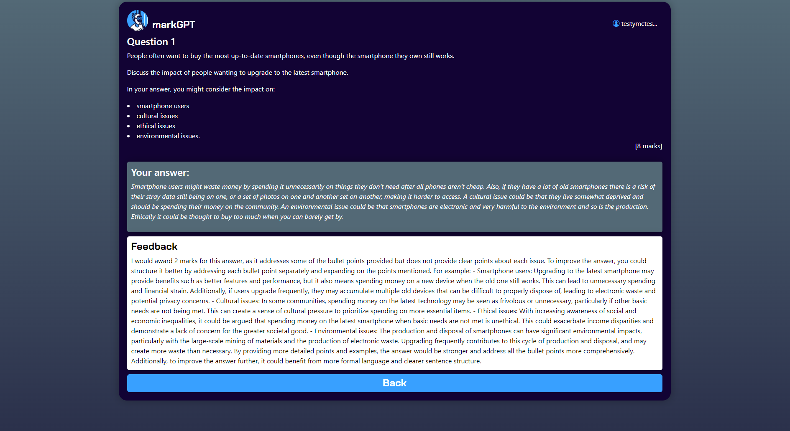

# markGPT - automated marking for GCSE Computer Science questions

A proof of concept for intelligent, instant feedback on essays using chatGPT. Reduces the feedback loop from weeks to seconds.

Flask for the backend, React for the front end. Uses OpenAI's GPT 3.5 model. Marking each essay costs < $0.002!
